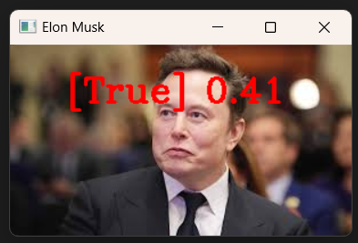

# Face Recognition Comparison Project

A Python-based face recognition system that compares and verifies faces in images using the `face_recognition` library. This project demonstrates how to detect faces, encode facial features, and compare similarity between different images.

## Features

- **Face Detection**: Automatically detects faces in images
- **Face Encoding**: Converts facial features into numerical encodings
- **Face Comparison**: Compares faces and calculates similarity distance
- **Visual Feedback**: Displays results with bounding boxes and similarity scores
- **Real-time Display**: Shows processed images with OpenCV

## 📸 Example Outputs

### Example:

## Prerequisites

Before running this project, ensure you have Python installed on your system (Python 3.6 or higher recommended).

## Installation

1. **Clone or download the project files**

2. **Install required dependencies:**
   ```bash
   pip install opencv-python
   pip install face-recognition
   pip install numpy
   ```

   **Note:** The `face_recognition` library requires `dlib`, which may need additional setup:
   - **Windows**: You might need Visual Studio C++ build tools
   - **macOS**: Install using `brew install cmake`
   - **Linux**: Install cmake and other dependencies: `sudo apt-get install cmake`

3. **Create the images directory structure:**
   ```
   project_folder/
   │
   ├── images/
   │   ├── elon musk.jpg
   │   └── elon_test.jpg
   │
   └── main.py
   ```

## Usage

1. **Prepare your images:**
   - Place your reference image in the `images/` folder as `elon musk.jpg`
   - Place your test image in the `images/` folder as `elon_test.jpg`

2. **Run the script:**
   ```bash
   python main.py
   ```

3. **View results:**
   - Two windows will open showing both images with face detection rectangles
   - The test image will display the comparison result and distance score
   - Press any key to close the windows

## How It Works

1. **Image Loading**: Loads both reference and test images using `face_recognition`
2. **Color Conversion**: Converts images from BGR to RGB format for proper processing
3. **Face Detection**: Locates faces in both images using built-in face detection
4. **Face Encoding**: Generates 128-dimensional face encodings for each detected face
5. **Face Comparison**: 
   - Compares encodings using `compare_faces()` (returns True/False)
   - Calculates face distance using `face_distance()` (lower = more similar)
6. **Visualization**: Draws rectangles around detected faces and displays results

## Understanding the Results

- **Comparison Result**: `True` means faces match, `False` means they don't
- **Face Distance**: 
  - Range: 0.0 to 1.0+
  - Lower values = more similar faces
  - Typical threshold: 0.6 (faces with distance < 0.6 are usually the same person)

## Troubleshooting

### Common Issues

1. **"No module named 'face_recognition'"**
   - Install the library: `pip install face-recognition`
   - On some systems, you may need: `pip3 install face-recognition`

2. **CMake or dlib installation errors**
   - **Windows**: Install Visual Studio Build Tools
   - **macOS**: `brew install cmake`
   - **Linux**: `sudo apt-get install build-essential cmake`

## Dependencies

- `opencv-python`: Image processing and display
- `face-recognition`: Face detection and recognition
- `numpy`: Numerical operations
- `dlib`: Backend for face recognition (installed automatically)

## License

This project is for educational and demonstration purposes. Please ensure you have appropriate permissions for any images you use.

## Contributing

Feel free to fork this project and submit improvements or bug fixes through pull requests.
